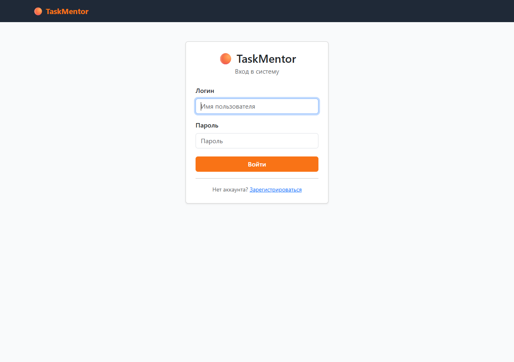
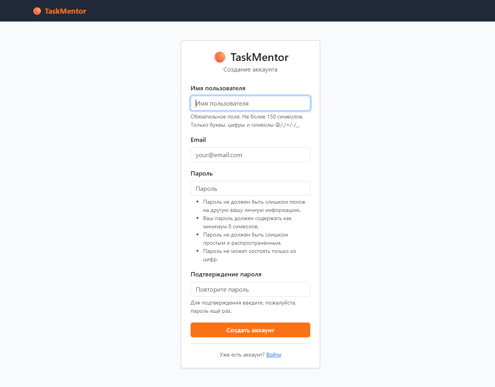
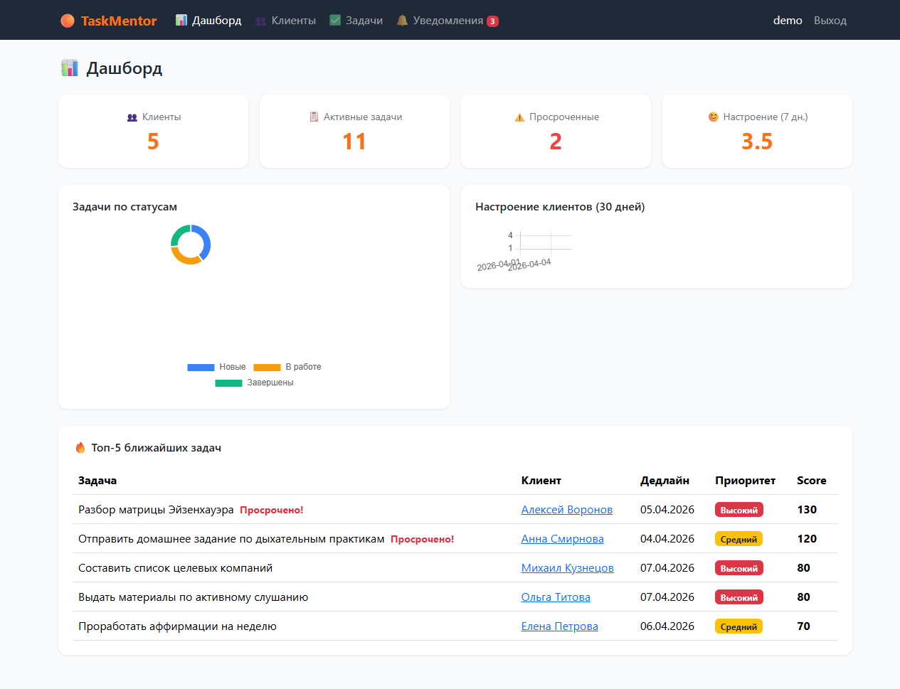
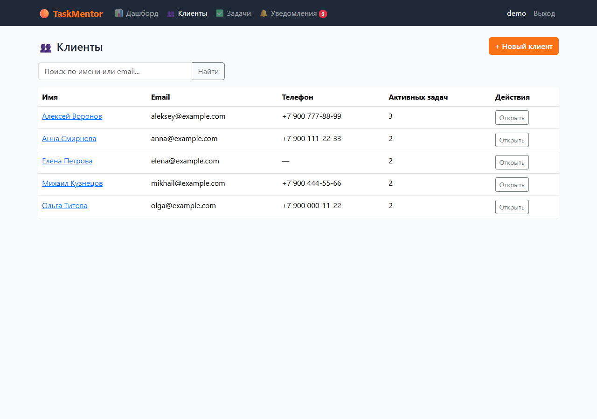
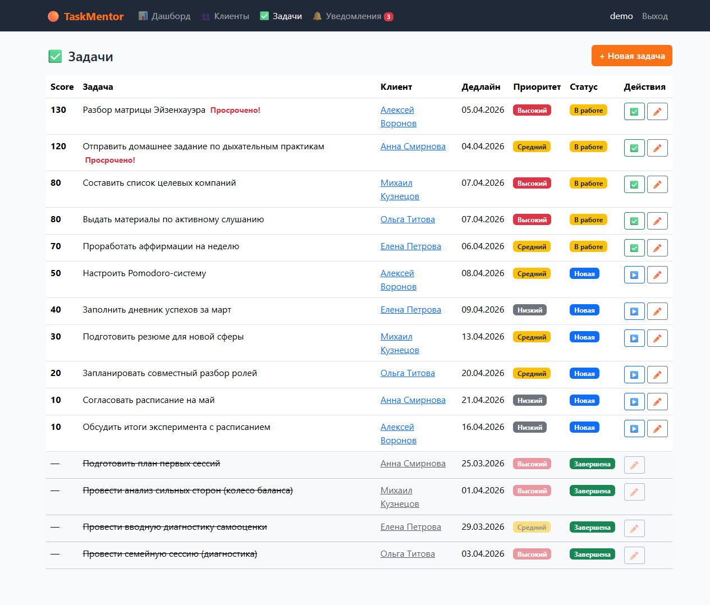
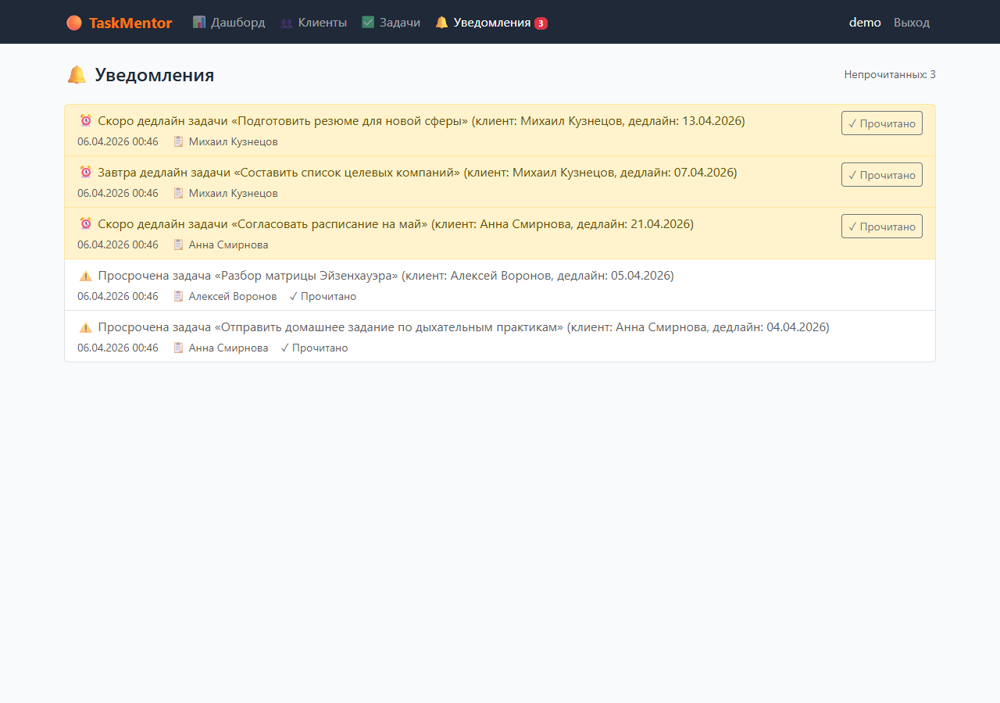

# TaskMentor

Веб-приложение для коучей, психологов и тренеров для управления клиентами, задачами и отслеживания самочувствия.

## Скриншоты

<table>
  <tr>
    <td align="center"><br/><sub>Страница входа</sub></td>
    <td align="center"><br/><sub>Регистрация нового пользователя</sub></td>
  </tr>
  <tr>
    <td align="center"><br/><sub>Дашборд — метрики и графики</sub></td>
    <td align="center"><br/><sub>Список клиентов</sub></td>
  </tr>
  <tr>
    <td align="center"><br/><sub>Задачи с умной сортировкой по score</sub></td>
    <td align="center"><br/><sub>Уведомления о дедлайнах</sub></td>
  </tr>
</table>

## Технологии

- **Python 3.12** + **Django 4.2 LTS**
- **SQLite** — база данных (без внешних сервисов)
- **Bootstrap 5.3** — UI (CDN, без сборщиков)
- **Chart.js 4.4.4** — интерактивные графики (CDN)
- **python-dotenv** — управление секретами

## Функциональность

- **Аутентификация** — регистрация, вход/выход
- **Клиенты** — CRUD, поиск по имени и email
- **Задачи** — CRUD, смена статуса (новая → в работе → завершена), умная сортировка по score (приоритет + близость дедлайна)
- **Самочувствие** — запись оценки 1–5 по дням, история, ограничение «одна запись в день» с возможностью обновления
- **Дашборд** — 4 метрики, Doughnut-диаграмма задач по статусам, Line-график настроения за 30 дней, топ-5 задач
- **Уведомления** — бейдж непрочитанных в навбаре, отметка прочитанным
- **Management command `notify_deadlines`** — создаёт уведомления для задач с дедлайном ≤ завтра

## Установка

```bash
# 1. Клонировать репозиторий
git clone <url>
cd taskmentor

# 2. Создать виртуальное окружение
py -3.12 -m venv venv
venv\Scripts\activate          # Windows
# source venv/bin/activate     # macOS/Linux

# 3. Установить зависимости
pip install -r requirements.txt

# 4. Создать .env файл
echo SECRET_KEY=your-secret-key-here > .env
echo DEBUG=True >> .env

# 5. Применить миграции
python manage.py migrate

# 6. Создать суперпользователя (опционально)
python manage.py createsuperuser
```

## Запуск

```bash
python manage.py runserver
```

Открыть в браузере: http://127.0.0.1:8000

## Демо-данные

Загрузить готовый набор тестовых данных (1 пользователь, 5 клиентов, 15 задач, 30 mood-записей, 5 уведомлений):

```bash
python manage.py loaddata demo_data
```

Войти под аккаунтом: **demo / demo12345**

Или сгенерировать демо-данные заново (и пересоздать fixture):

```bash
python manage.py create_demo_fixture
```

## Management commands

| Команда | Описание |
|---------|----------|
| `notify_deadlines` | Создаёт уведомления для задач с дедлайном ≤ завтра. Повторный запуск в тот же день не создаёт дубли. |
| `create_demo_data --clear` | Наполняет БД тестовыми данными (3 клиента, 10 задач, 60 mood-записей). |
| `create_demo_fixture` | Создаёт/обновляет `fixtures/demo_data.json`. |

## Структура проекта

```
taskmentor/
├── config/               # Настройки Django
│   ├── settings.py
│   └── urls.py
├── core/                 # Основное приложение
│   ├── models.py         # Client, Task, MoodEntry, Notification
│   ├── views.py          # Только FBV
│   ├── forms.py
│   ├── urls.py
│   ├── admin.py
│   ├── context_processors.py
│   ├── templates/
│   │   ├── base.html
│   │   └── core/
│   ├── static/core/css/style.css
│   ├── management/commands/
│   │   ├── notify_deadlines.py
│   │   ├── create_demo_data.py
│   │   └── create_demo_fixture.py
│   └── migrations/
├── fixtures/
│   └── demo_data.json
├── requirements.txt
└── .env                  # не коммитится
```

## Дипломный проект

Курс «Python с нуля с помощью ChatGPT 2.0» — Zerocoder.
